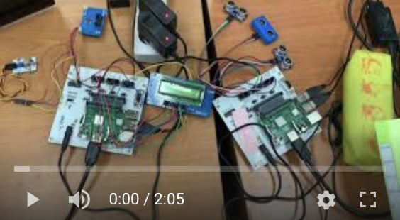

## 1. 프로젝트 명칭 : SMART PARKING
초음파센서와 LCD를 이용하여 빈자리를 찾아주고 화재를 감지하면 소리 경보가 발생하는 주차장

## 2. 프로젝트 목적 
- TEXT LCD 동작 이해
- 초음파센서 사용과 이를 이용한 변수 사용 능력 향상 
- 가스 센서 사용을 통해 Buzzer와 연동시키는 접목 능력 향상
- 서버 구축을 통한 데이터베이스를 이용해 Rasberry Pi 간 센서값 연동

주차장을 모형으로 구성하여 주차 빈자리를 초음파센서를 통하여 빈자리의 위치를 알아내고 각 포인트 지점(길이 갈리는 곳)에 TEXT LCD를 위치시키고 그곳에서 주차구역 A-1, A-2, A-3에 수를 표현해주어 빈자리의 위치를 대략 파악하고 빈자리가 없는 곳을 가는 일을 줄인다. 또한, 주차장 내 화재를 방지하기 위하여 차량 배기관 쪽에 가스 센서를 달아 가스감지가 5초 이상 지속될 시 Buzzer가 울려 화재를 방지할 수 있도록 구성한다. 서버를 구축하고 데이터베이스를 통하여 주차장 전체 데이터를 통신할 수 있게 한다.

- 통신 방법 : mySQL을 통한 데이터 송수신
- 구현하고자 하는 기능 
	- 초음파센서값의 사용
	- MySQL 데이터베이스를 이용한 데이터 통신
	- TEXT LCD를 이용한 변수 표현
: 가스 센서에 따른 Buzzer 출력
- 초음파센서 길이 : 20cm 내외  
가스 센서 시간 : 5초
...
>더 많은 내용은 자료참고

### 실행 유튜브 영상
- 하단 이미지 클릭시 재생   
 

